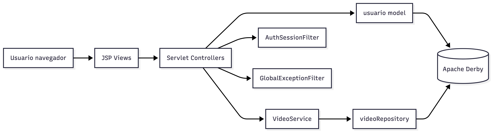
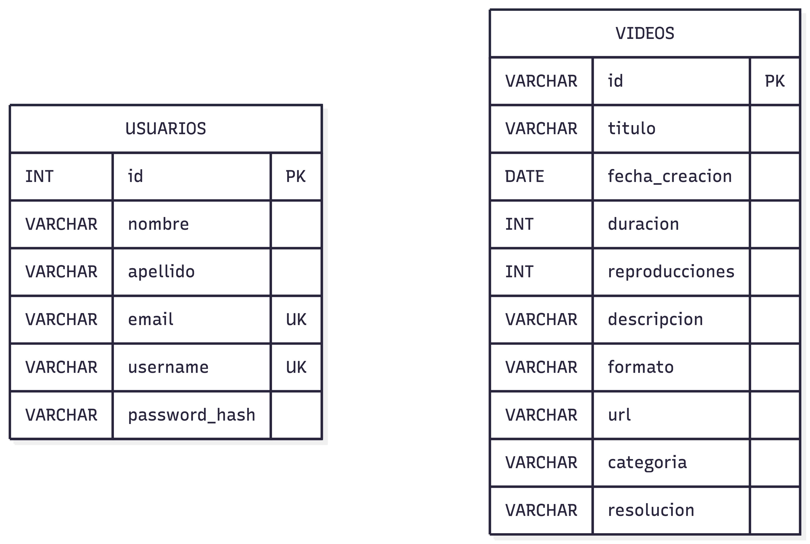
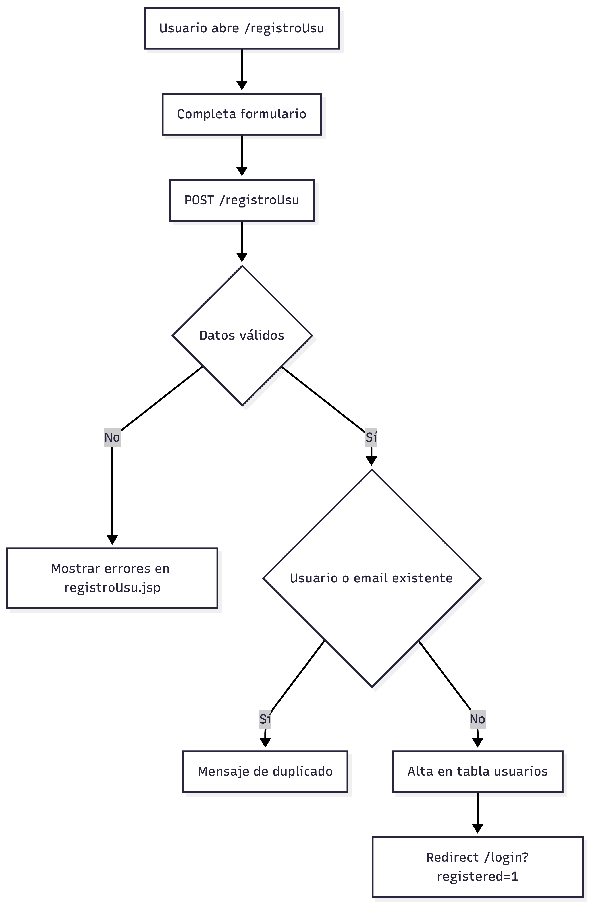
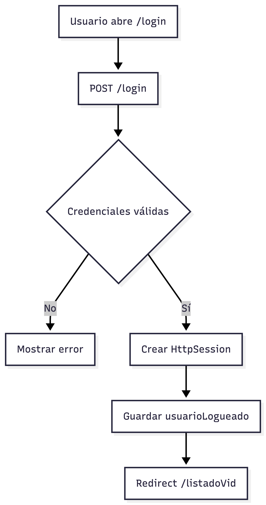
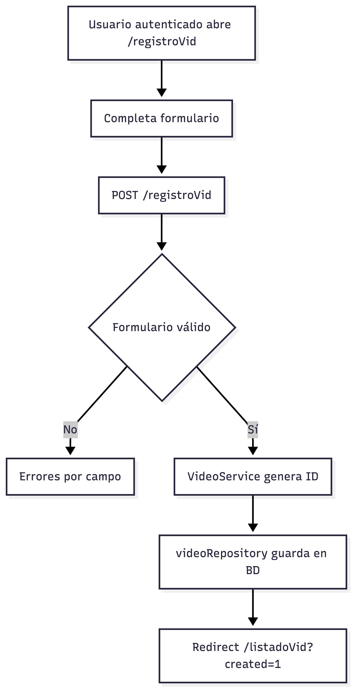
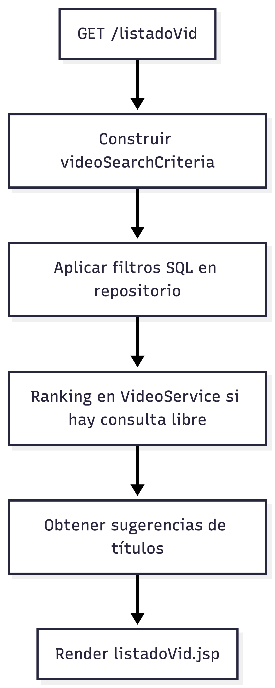
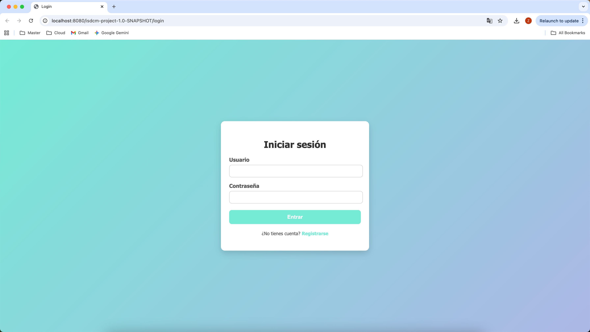
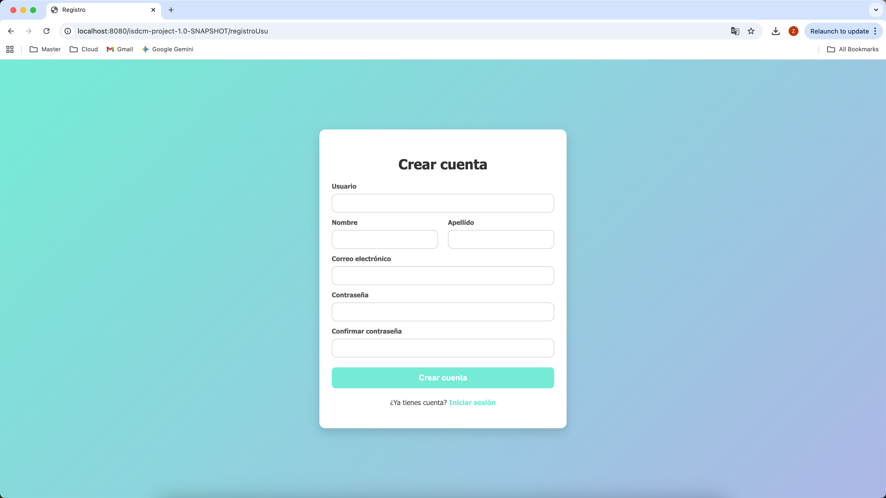
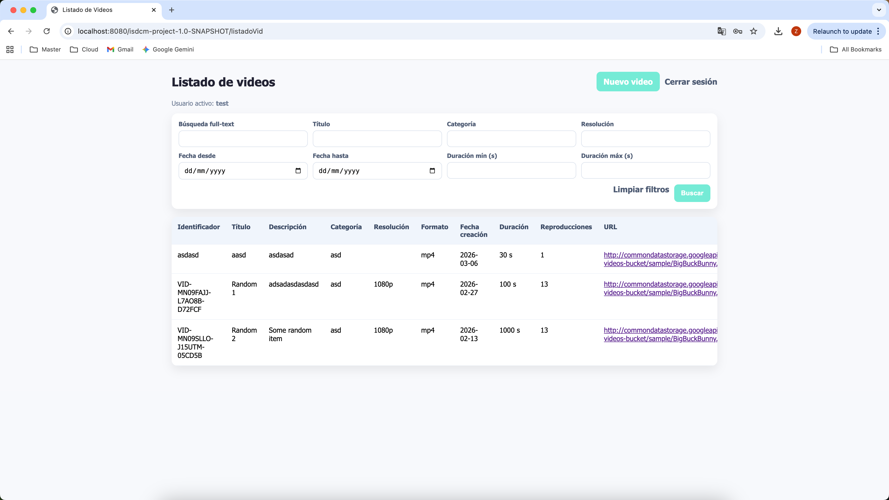
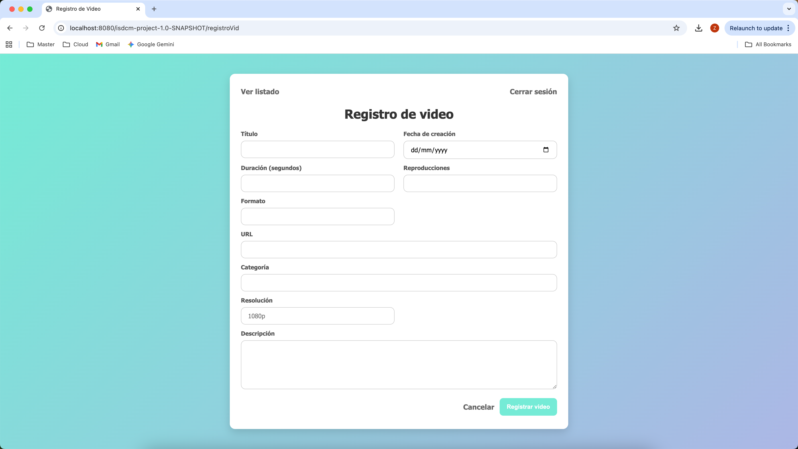

# ISDCM — Entrega 1  
## Documentación técnica y funcional

**Asignatura:** ISDCM  
**Proyecto:** Aplicación web de gestión de usuarios y vídeos  
**Versión del documento:** 1.0  
**Fecha:** 2026-03-21  
**Estudiante:** Zhipeng Lin (zhipeng.lin@estudiantat.upc.edu)
**Estudiante:** Zhiwei Lin (zhiwei.lin1@estudiantat.upc.edu)


## Tabla de contenidos

1. [Introducción](#introducción)  
2. [Alcance y objetivos](#alcance-y-objetivos)  
3. [Arquitectura del sistema](#arquitectura-del-sistema)  
4. [Decisiones de diseño](#decisiones-de-diseño)  
5. [Especificaciones técnicas](#especificaciones-técnicas)  
6. [Modelo de datos](#modelo-de-datos)  
7. [Flujos de usuario](#flujos-de-usuario)  
8. [Manual de instalación y configuración](#manual-de-instalación-y-configuración)  
9. [Guía de usuario final](#guía-de-usuario-final)  
10. [Fragmentos de código explicados](#fragmentos-de-código-explicados)  
11. [Pruebas realizadas y resultados](#pruebas-realizadas-y-resultados)  
12. [Cumplimiento de requisitos](#cumplimiento-de-requisitos)  
13. [Cumplimiento de rúbrica](#cumplimiento-de-rúbrica)  
14. [Capturas de pantalla y evidencias visuales](#capturas-de-pantalla-y-evidencias-visuales)  
15. [Conclusiones](#conclusiones)  
16. [Trabajo futuro](#trabajo-futuro)  

## Introducción

El proyecto ISDCM (Entrega 1) implementa una aplicación web para la gestión de usuarios y vídeos.  
La solución desarrollada cubre las funcionalidades de:

- Registro de usuarios.
- Inicio y cierre de sesión.
- Registro de vídeos para usuarios autenticados.
- Listado y filtrado de vídeos disponibles.

La implementación sigue el enfoque MVC solicitado en el enunciado, utiliza Java 17 con Jakarta EE y persistencia relacional sobre Apache Derby.

## Alcance y objetivos

### Objetivo general

Construir una aplicación web funcional y mantenible para gestionar usuarios y vídeos, respetando los requisitos de la Entrega 1 y la rúbrica de evaluación.

### Objetivos específicos

- Aplicar patrón MVC en toda la aplicación.
- Restringir operaciones de vídeo a usuarios autenticados mediante sesión.
- Persistir datos en base de datos relacional usando clases de acceso dedicadas.
- Validar entradas de formularios y manejar errores de ejecución.
- Entregar un sistema con documentación técnica y funcional verificable.

### Alcance implementado

- Módulo de usuarios (`/login`, `/registroUsu`, `/logout`).
- Módulo de vídeos (`/registroVid`, `/listadoVid`).
- Filtro de autenticación para proteger rutas de vídeo.
- Filtro global para excepciones no controladas.
- Validaciones de entrada en servidor para usuarios y vídeos.
- Búsqueda y filtrado de vídeos por criterios múltiples.

## Arquitectura del sistema

La arquitectura implementada es una arquitectura web monolítica por capas basada en MVC:

- **Controlador:** Servlets y filtros HTTP.
- **Modelo:** Entidades, criterios, validadores y repositorios JDBC.
- **Servicio:** Lógica de negocio para registro, scoring y sugerencias.
- **Vista:** Páginas JSP en `WEB-INF/views`.

### Diagrama de componentes



### Relación entre componentes

- Las vistas envían formularios a servlets.
- Los servlets validan, orquestan y delegan acceso a datos/lógica.
- `VideoService` encapsula reglas de negocio de vídeo (ID, ranking y sugerencias).
- `videoRepository` y `usuario` gestionan operaciones SQL con `PreparedStatement`.
- Los filtros aplican seguridad de sesión y control transversal de errores.

## Decisiones de diseño

### Patrón MVC

Se adopta MVC para separar presentación, lógica de negocio y acceso a datos, facilitando mantenibilidad y pruebas.

### Tecnologías

- Java 17.
- Jakarta Servlet/JSP (Jakarta EE 9.1).
- Maven (empaquetado WAR).
- Apache Derby (modo red con fallback embebido).
- JUnit 5 para pruebas unitarias.

### Estructuras de datos y dominio

- Entidad `video` con atributos de identificación, metadatos y clasificación.
- Entidad persistente de usuario con hash de contraseña.
- Objeto de criterios `videoSearchCriteria` para filtros de búsqueda.
- Mapas clave-valor para manejo de formularios y errores de campo.

### Seguridad

- Sesiones con `HttpSession` para proteger funcionalidades de vídeo.
- Hash SHA-256 de contraseñas antes de persistir y validar.
- Uso de consultas parametrizadas para mitigar inyección SQL.

### Control de errores

- Mensajes funcionales por validación y por error de negocio.
- Captura de excepciones SQL en controladores.
- Filtro global de excepciones para vista de error uniforme.

## Especificaciones técnicas

### Estructura del proyecto

```text
src/main/java/org/example/isdcmproject/
  controller/ (servlets + filters)
  model/      (entidades + repositorio + validador + proveedor BD)
  service/    (lógica de negocio)
src/main/webapp/WEB-INF/views/
  login.jsp, registroUsu.jsp, registroVid.jsp, listadoVid.jsp, error.jsp
```

### Endpoints principales

- `GET/POST /login`: autenticación.
- `GET/POST /registroUsu`: alta de usuario.
- `GET /logout`: cierre de sesión.
- `GET/POST /registroVid`: alta de vídeo.
- `GET /listadoVid`: listado y filtrado.

### Sesión y autorización

- Atributo de sesión: `usuarioLogueado`.
- Filtro de seguridad en: `/videos`, `/videos/*`, `/registroVid`, `/listadoVid`.
- Redirección a login cuando no existe sesión válida.

### Validación de datos

**Usuarios:**
- Campos obligatorios.
- Validación de email con regex.
- Restricción de username (4-20 alfanuméricos con `._-`).
- Contraseña mínima y confirmación.

**Vídeos:**
- Campos obligatorios en todos los atributos funcionales.
- Fecha válida.
- Duración y reproducciones enteras no negativas.
- URL con esquema y host válidos.

### Persistencia y base de datos

**Tabla `usuarios`:**
- `id`, `nombre`, `apellido`, `email` (único), `username` (único), `password_hash`.

**Tabla `videos`:**
- `id` (PK), `titulo`, `fecha_creacion`, `duracion`, `reproducciones`,
  `descripcion`, `formato`, `url`, `categoria`, `resolucion`.

**Aspectos técnicos de BD:**
- Inicialización automática de tablas en `init()` de servlets.
- Índices de apoyo en título, categoría, fecha, duración y resolución.
- Migraciones ligeras idempotentes en repositorio de vídeo.

## Modelo de datos

### Modelo entidad-relación



### Reglas de integridad relevantes

- Unicidad de email y username de usuario.
- Unicidad de identificador de vídeo.
- Campos críticos declarados `NOT NULL`.
- Rango semántico no negativo validado en capa de aplicación.

## Flujos de usuario

### Flujo 1: Registro de usuario



### Flujo 2: Login y control de sesión


### Flujo 3: Registro de vídeo



### Flujo 4: Listado y búsqueda



## Manual de instalación y configuración

### Requisitos previos

- JDK 17 instalado y disponible en `JAVA_HOME`.
- Maven Wrapper del proyecto (`mvnw` / `mvnw.cmd`).
- Contenedor compatible Jakarta EE 9.1 para desplegar WAR.

### Pasos de instalación

1. Clonar/copiar el proyecto.
2. Entrar al directorio raíz del proyecto.
3. Ejecutar compilación y pruebas:

```bash
./mvnw clean test
```

4. Generar paquete desplegable:

```bash
./mvnw clean package
```

### Configuración de base de datos

La conexión de datos se resuelve automáticamente con:

- Intento 1 (red): `jdbc:derby://localhost:1527/pr2;create=true`
- Intento 2 (fallback embebido): `jdbc:derby:pr2;create=true`

Pero en nuestro caso la conexión siempre será a la base de datos en embedded mode. Ya que es el que da menos problemas de configuración.

No se requiere script SQL manual inicial; el sistema crea tablas/índices al arrancar los servlets.

### Despliegue

- Desplegar `target/isdcm-project-1.0-SNAPSHOT.war` en servidor de aplicaciones.
- Verificar acceso inicial en `/login`.

## Guía de usuario final

### 1) Crear cuenta

- Ir a `/registroUsu`.
- Completar usuario, nombre, apellido, correo y contraseñas.
- Enviar formulario y validar mensaje de alta.

### 2) Iniciar sesión

- Ir a `/login`.
- Introducir usuario y contraseña.
- Acceder al listado de vídeos.

### 3) Registrar vídeo

- Ir a `/registroVid`.
- Completar campos requeridos del vídeo.
- Confirmar registro y redirección al listado.

### 4) Consultar y filtrar vídeos

- Ir a `/listadoVid`.
- Usar búsqueda libre, filtros por título/categoría/resolución, fechas y duración.
- Revisar tabla de resultados y enlaces URL.

### 5) Cerrar sesión

- Pulsar “Cerrar sesión”.
- El sistema invalida sesión y redirige a login.

## Fragmentos de código explicados

### Control de acceso por sesión

Este fragmento garantiza que solo usuarios autenticados entren a rutas protegidas:

```java
HttpSession session = httpRequest.getSession(false);
Object usuarioLogueado = session == null ? null : session.getAttribute("usuarioLogueado");
if (usuarioLogueado == null) {
    httpResponse.sendRedirect(httpRequest.getContextPath() + "/login?auth=required");
    return;
}
chain.doFilter(request, response);
```

Interpretación:
- Si no hay sesión o no existe `usuarioLogueado`, se redirige a login.
- Si la sesión es válida, la petición continúa.

### Inserción segura en base de datos

Este fragmento muestra inserción parametrizada para evitar inyección SQL:

```java
String sql = "INSERT INTO videos (id, titulo, fecha_creacion, duracion, reproducciones, descripcion, formato, url, categoria, resolucion) VALUES (?, ?, ?, ?, ?, ?, ?, ?, ?, ?)";
try (Connection connection = DatabaseProvider.getConnection();
     PreparedStatement statement = connection.prepareStatement(sql)) {
    statement.setString(1, video.getIdentificador());
    statement.setString(2, video.getTitulo());
    statement.setDate(3, Date.valueOf(video.getFechaCreacion()));
    statement.setInt(4, video.getDuracion());
    statement.setInt(5, video.getReproducciones());
    statement.setString(6, video.getDescripcion());
    statement.setString(7, video.getFormato());
    statement.setString(8, video.getUrl());
    statement.setString(9, video.getCategoria());
    statement.setString(10, video.getResolucion());
    statement.executeUpdate();
}
```

Interpretación:
- La consulta usa placeholders `?` y binding tipado.
- Los datos del formulario no se concatenan en SQL.

### Validación de URL de vídeo

Este fragmento valida formato de URL antes de registrar:

```java
private boolean isValidUrl(String url) {
    try {
        URI uri = URI.create(url);
        return uri.getScheme() != null && uri.getHost() != null;
    } catch (IllegalArgumentException e) {
        return false;
    }
}
```

Interpretación:
- Solo se aceptan URLs con esquema y host.
- Si la URL es inválida, la validación falla y se muestra error de campo.

## Pruebas realizadas y resultados

### Pruebas automatizadas ejecutadas

Comando ejecutado:

```bash
./mvnw test
```

Resultado observado:

- Build: **SUCCESS**
- Total tests: **4**
- Fallos: **0**
- Errores: **0**
- Suites:
  - `videoValidatorTest` (3 pruebas, OK)
  - `videoIdGeneratorTest` (1 prueba, OK)

### Cobertura funcional validada manualmente

- Registro de usuario con validaciones y duplicados.
- Login con creación de sesión y bloqueo de rutas protegidas sin sesión.
- Registro de vídeo con validación por campo.
- Listado de vídeos con filtros combinados y sugerencias.
- Manejo de errores SQL y excepción global con vista dedicada.

## Cumplimiento de requisitos

| Requisito | Estado | Evidencia implementada |
|---|---|---|
| Patrón MVC | Cumplido | Separación controller/model/service/views |
| Registro de usuarios | Cumplido | `/registroUsu` + persistencia `usuarios` |
| Login y sesiones | Cumplido | `HttpSession` + `AuthSessionFilter` |
| Registro de vídeos | Cumplido | `/registroVid` + `videoValidator` + `VideoService` |
| Listado de vídeos | Cumplido | `/listadoVid` + consulta en repositorio |
| Datos mínimos de vídeo | Cumplido | id, título, fecha, duración, reproducciones, descripción, formato |
| Control de errores | Cumplido | validaciones, SQL handling, filtro global |
| Acceso BD con clases dedicadas | Cumplido | `usuario`, `videoRepository`, `DatabaseProvider` |
| Uso de PreparedStatement | Cumplido | inserciones y consultas parametrizadas |
| Uso de packages | Cumplido | `org.example.isdcmproject.*` en todas las clases Java |

## Cumplimiento de rúbrica

| Criterio rúbrica | Evidencia en la implementación | Nivel estimado |
|---|---|---|
| Informe | Documento estructurado con índice, secciones y evidencias | Correcto |
| Uso de MVC | Controladores, modelo/repositorio/servicio y vistas JSP separados | Correcto |
| Sesiones completo | Sesión en login, validación en filtro, uso en vistas protegidas | Correcto |
| Gestión BD | Clases de acceso específicas + `PreparedStatement` | Correcto |
| Uso de packages | Clases Java organizadas bajo paquete de proyecto | Correcto |
| Control de errores de ejecución | Captura en controladores y filtro global | Correcto |
| Control valores entrada | Validación en formularios de usuario y vídeo | Correcto |
| Extras | Servicio de scoring, sugerencias, índices y migraciones ligeras | Extra aportado |

## Capturas de pantalla y evidencias visuales

### Capturas de pantalla






## Conclusiones

La aplicación implementa correctamente los objetivos de la Entrega 1: gestión de usuarios, sesiones, registro de vídeos y listado con filtros, siguiendo arquitectura MVC y buenas prácticas de acceso a datos.  
Se evidencia cumplimiento de criterios funcionales y no funcionales principales: seguridad base, validación de entradas, manejo de errores y estructura mantenible por capas.  
Las pruebas automatizadas ejecutadas confirman estabilidad en componentes críticos de validación y generación de identificadores.
